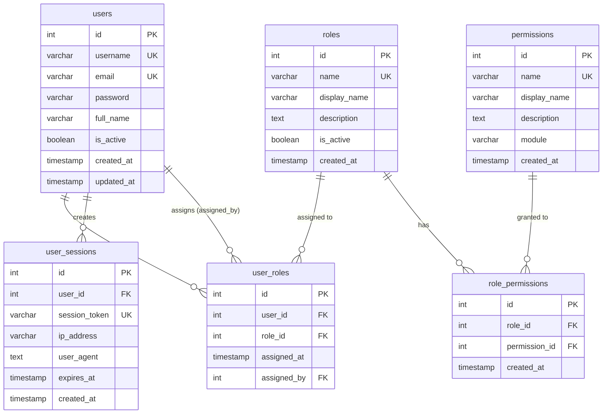

# ERD Diagram - ระบบ CPS



## ความสัมพันธ์ (Relationships)

### 1. **users ↔ user_roles** (One-to-Many)
- ผู้ใช้ 1 คน สามารถมีหลาย roles
- user_roles.user_id → users.id

### 2. **roles ↔ user_roles** (One-to-Many)  
- role 1 ตัว สามารถกำหนดให้หลายผู้ใช้
- user_roles.role_id → roles.id

### 3. **roles ↔ role_permissions** (One-to-Many)
- role 1 ตัว สามารถมีหลาย permissions
- role_permissions.role_id → roles.id

### 4. **permissions ↔ role_permissions** (One-to-Many)
- permission 1 ตัว สามารถกำหนดให้หลาย roles
- role_permissions.permission_id → permissions.id

### 5. **users ↔ user_sessions** (One-to-Many)
- ผู้ใช้ 1 คน สามารถมีหลาย sessions
- user_sessions.user_id → users.id

### 6. **users ↔ user_roles (assigned_by)** (One-to-Many)
- ผู้ใช้ 1 คน สามารถกำหนด role ให้ผู้อื่นได้หลายครั้ง
- user_roles.assigned_by → users.id

## ตัวอย่างข้อมูล

### Users
| id | username | full_name | roles |
|----|----------|-----------|-------|
| 1 | admin | ผู้ดูแลระบบ | super_admin, admin |
| 2 | manager | ผู้จัดการ | manager, user |
| 3 | user1 | ผู้ใช้ 1 | user |

### Permissions Structure
```
user.* → จัดการผู้ใช้
role.* → จัดการบทบาท  
permission.* → จัดการสิทธิ์
dashboard.view → เข้าถึง Dashboard
system.admin → ผู้ดูแลระบบ
```